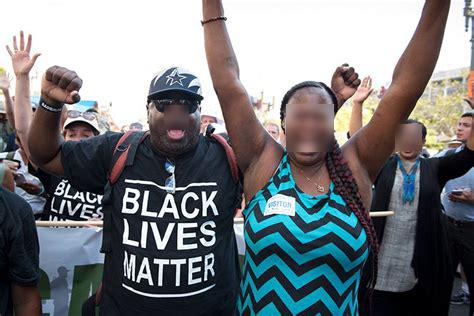

# Privacy Protection

[](https://github.com/psf/black)
[](LICENSE)
[](https://www.python.org/downloads/)
[](https://paypal.me/mmphego)

Detect human faces in the image and for the sake of privacy, anonymize the images by blurring people's faces in the image automatically.

# Usage

```bash
docker run --rm -ti \
--volume "$PWD":/app \
--env DISPLAY=$DISPLAY \
--volume=$HOME/.Xauthority:/root/.Xauthority \
--volume="/tmp/.X11-unix:/tmp/.X11-unix:rw" \
--device /dev/video0 \
mmphego/intel-openvino \
bash -c "\
    source /opt/intel/openvino/bin/setupvars.sh && \
    python main.py -i blm.jpg
    "
```

## Example

Input image:


---
Output image:



**Note:** False detections are inevitable using `cascade classifiers` and if you want to have a really precise detector, you will have to train it yourself using [OpenCV train cascade utility](https://docs.opencv.org/2.4.13.7/doc/user_guide/ug_traincascade.html).

# Feedback

Feel free to fork it or send me PR to improve it.

# Credits

This package was created with [Cookiecutter](https://github.com/audreyr/cookiecutter) and the [mmphego/cookiecutter-python-package](https://github.com/mmphego/cookiecutter-python-package) project template.
